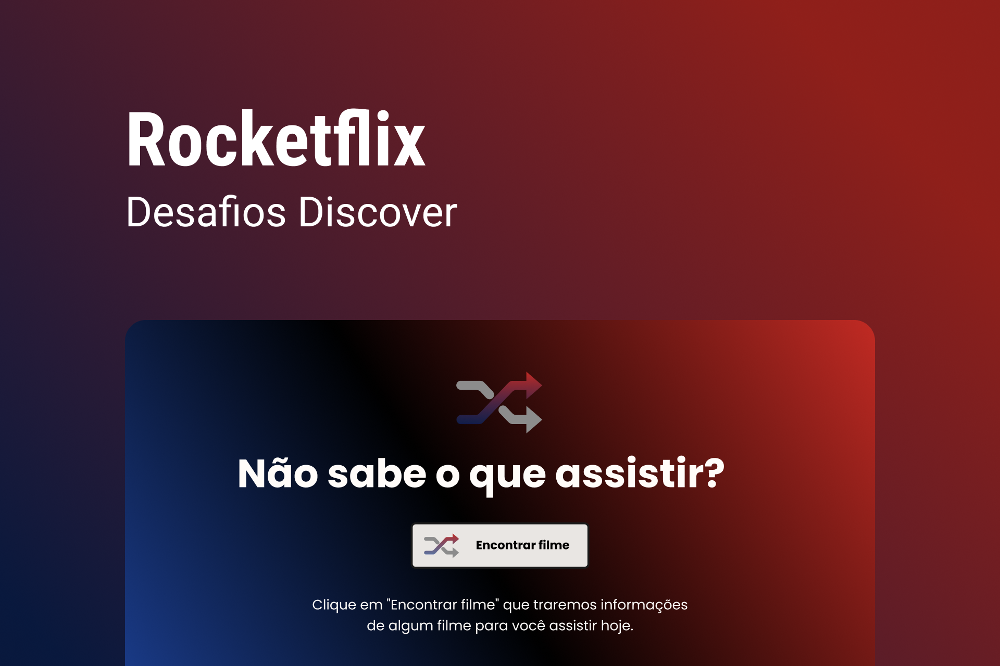

# rocketflix

<a href="https://github.com/bw3sley/number2words/blob/main/LICENSE.md">

</a>

</br>



[Click here to see the design](https://www.figma.com/file/9HFoO4wNB150gRSV4v0Qse/DD-%2F-Rocketflix/duplicate) you need to have an account on [Figma](https://www.figma.com/).

</br>

## 💻 About this project

This project proposal was to fetch an API from [The Movie Database TMDB](https://www.themoviedb.org/) and display a movie image and description every click from the button. It's a **challenge** provided by the [Rocketseat's Discover trail](https://www.rocketseat.com.br/discover).

I'll be happy if you could send me any feedback about the project, code, structure or anything that you can report that could make me better as a developer!

And you can use this project as you wish!

</br>

## :octocat: Cloning repo

```bash
    $ git clone https://github.com/bw3sley/rocketflix.git
    
    $ cd rocketflixClone 
```

</br>

## 🚀 Built with

This project was built with:

- HTML
- CSS
- JavaScript

</br>

## 📩 Reach me out

You can reach me on:

Reach me at: bw3sley@gmail.com

Connect with me at [LinkedIn](https://www.linkedin.com/in/bw3sley)

</br>

## 📝 License

This project is licensed under the MIT License - see the [LICENSE.md](./LICENSE.md) file for details.